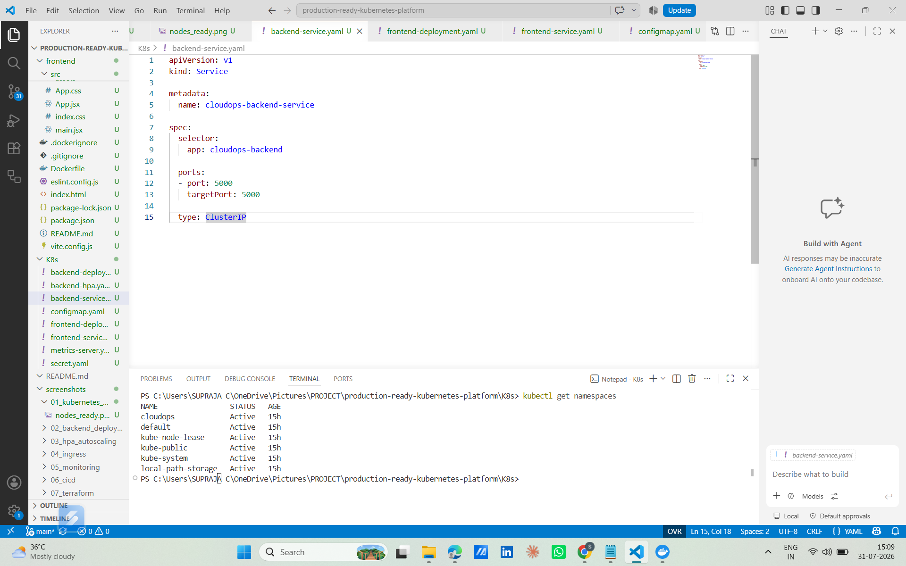
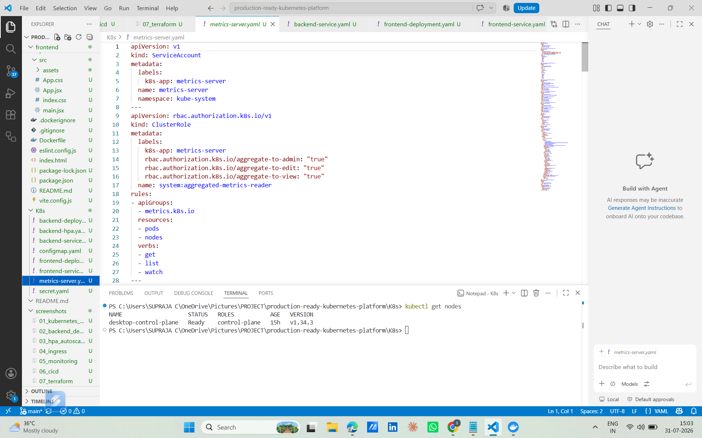
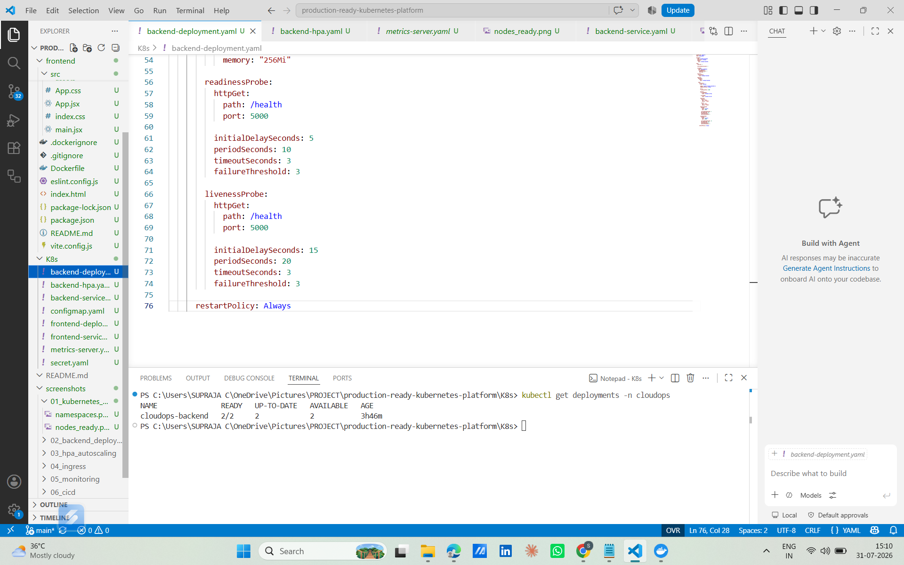
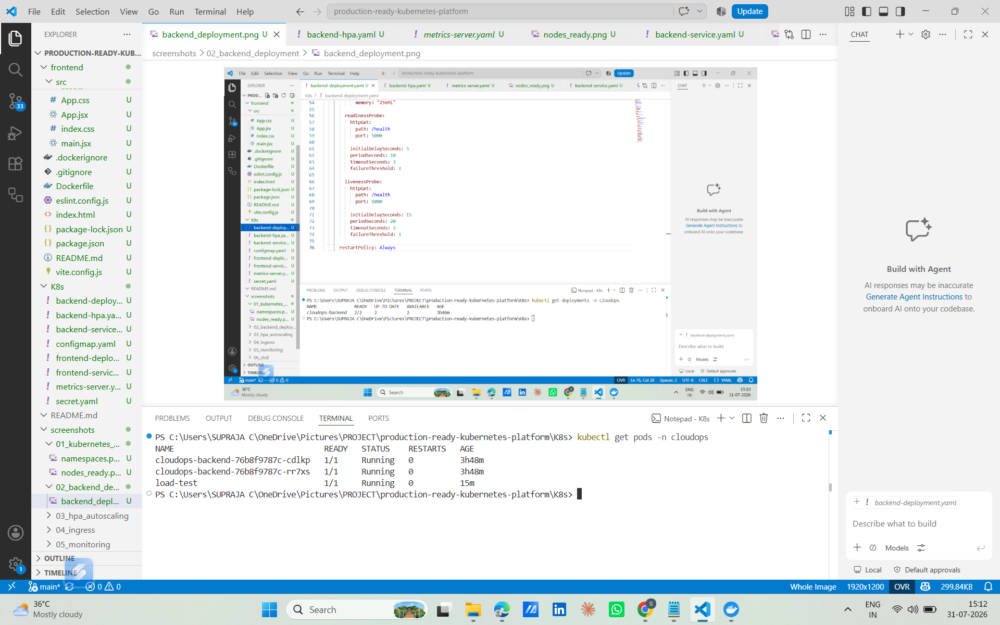
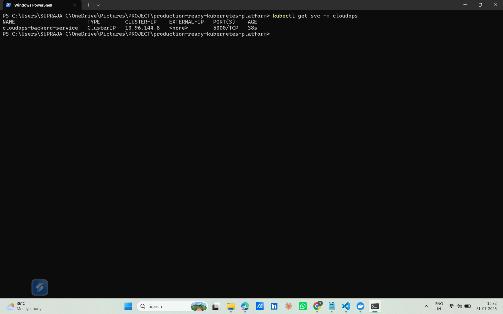
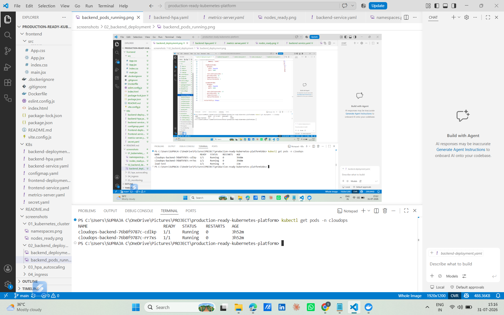

<div align="center">

# 🚀 Production-Ready Kubernetes Platform

### Enterprise-Grade Cloud-Native Application Deployment on Kubernetes

A production-ready DevOps project demonstrating Kubernetes best practices including Deployments, Services, Ingress, Horizontal Pod Autoscaling (HPA), Persistent Volumes, ConfigMaps, Secrets, Network Policies, Helm, Prometheus, and Grafana Monitoring.


</div>

---

# 📖 Project Overview

This project demonstrates how a cloud-native application can be deployed on Kubernetes using production-ready DevOps practices.

The platform consists of a Flask backend and a frontend application deployed as Kubernetes workloads. It includes high availability, automatic scaling, persistent storage, monitoring, secure configuration management, and package management using Helm.

The goal of this project is to simulate how applications are deployed and managed in real production Kubernetes clusters.

---

# ✨ Key Features

- Kubernetes Deployments
- ReplicaSets
- Rolling Updates
- Backend & Frontend Services
- NGINX Ingress Controller
- ConfigMaps
- Kubernetes Secrets
- Resource Requests & Limits
- Readiness Probes
- Liveness Probes
- Horizontal Pod Autoscaler (HPA)
- Persistent Volume (PV)
- Persistent Volume Claim (PVC)
- Network Policies
- Prometheus Monitoring
- Grafana Dashboards
- Helm Charts
- Metrics Server Integration

---

# 🛠 Technology Stack

| Category | Technologies |
|-----------|-------------|
| Containerization | Docker |
| Orchestration | Kubernetes |
| Backend | Flask (Python) |
| Frontend | React |
| Web Server | NGINX |
| Monitoring | Prometheus |
| Visualization | Grafana |
| Package Manager | Helm |
| Configuration | ConfigMaps |
| Secrets | Kubernetes Secrets |
| Storage | Persistent Volume & PVC |
| Scaling | Horizontal Pod Autoscaler |
| Networking | Kubernetes Services & Ingress |

---

# 📁 Project Structure

```text
production-ready-kubernetes-platform/
│
├── backend/
│   ├── app.py
│   ├── Dockerfile
│   └── requirements.txt
│
├── frontend/
│
├── K8s/
│   ├── backend-deployment.yaml
│   ├── frontend-deployment.yaml
│   ├── backend-service.yaml
│   ├── frontend-service.yaml
│   ├── ingress.yaml
│   ├── backend-hpa.yaml
│   ├── configmap.yaml
│   ├── secret.yaml
│   ├── persistent-volume.yaml
│   ├── persistent-volume-claim.yaml
│   └── network-policy.yaml
│
├── screenshots/
│
└── README.md
```

---

# 🏗 Architecture

This project follows a production-style Kubernetes architecture.

```
                    Internet
                        │
                NGINX Ingress Controller
                        │
         ┌──────────────┴──────────────┐
         │                             │
    Frontend Service              Backend Service
         │                             │
     Frontend Pods               Backend Pods
                                      │
                          ConfigMap + Secret
                                      │
                           Persistent Volume
                                      │
                         Horizontal Pod Autoscaler
                                      │
                      Prometheus + Grafana Monitoring
```

---

# 🚀 Kubernetes Cluster

The application is deployed inside a dedicated Kubernetes namespace.

## Namespace



---

## Worker Nodes



---

# 🚀 Backend Deployment

The backend application is deployed using a Kubernetes Deployment with multiple replicas to ensure high availability.

## Backend Deployment



---

## Backend Pods



---

## Backend Service



---

## Healthy Backend Pods



---

