# 🚀 Production-Ready Kubernetes Platform

A production-ready cloud-native application deployed on Kubernetes with best practices including Deployments, Services, Ingress, HPA, ConfigMaps, Secrets, Persistent Volumes, Network Policies, Prometheus, Grafana, and Helm.

---

# 📌 Project Overview

This project demonstrates how a modern microservice application is deployed on Kubernetes using production-ready architecture.

## Tech Stack

- Kubernetes
- Docker
- Flask
- React
- Python
- Nginx
- Helm
- Prometheus
- Grafana
- ConfigMaps
- Secrets
- Persistent Volumes
- Horizontal Pod Autoscaler
- Network Policies

---

# 📂 Project Structure

```
production-ready-kubernetes-platform
│
├── backend/
├── frontend/
├── K8s/
├── screenshots/
└── README.md
```

---

# 🏗 Architecture

> Add your architecture diagram here.

```
architecture/
```

---

# 🚀 Features

- Kubernetes Deployments
- ReplicaSets
- Rolling Updates
- Services
- Ingress Controller
- ConfigMaps
- Secrets
- Resource Requests & Limits
- Liveness Probe
- Readiness Probe
- Horizontal Pod Autoscaler
- Persistent Volumes
- Persistent Volume Claims
- Network Policies
- Helm Deployment
- Prometheus Monitoring
- Grafana Dashboards

---

# 1️⃣ Kubernetes Cluster

## Namespaces


---

## Nodes Ready


---

# 2️⃣ Backend Deployment

## Backend Deployment


---

## Backend Pods Running


---

## Backend Service


---

## Clean Backend Pods


---

# 3️⃣ Horizontal Pod Autoscaler

## HPA Created

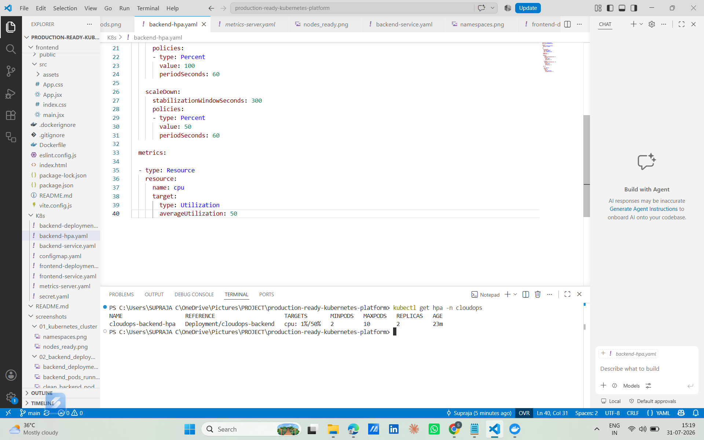

---

## Metrics Server Working

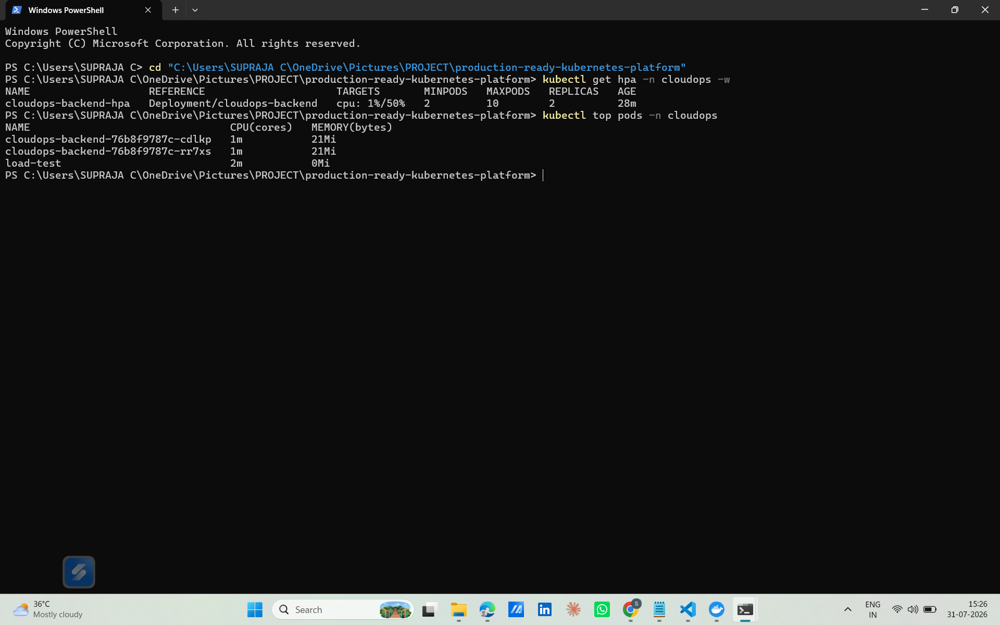

---

## Autoscaling

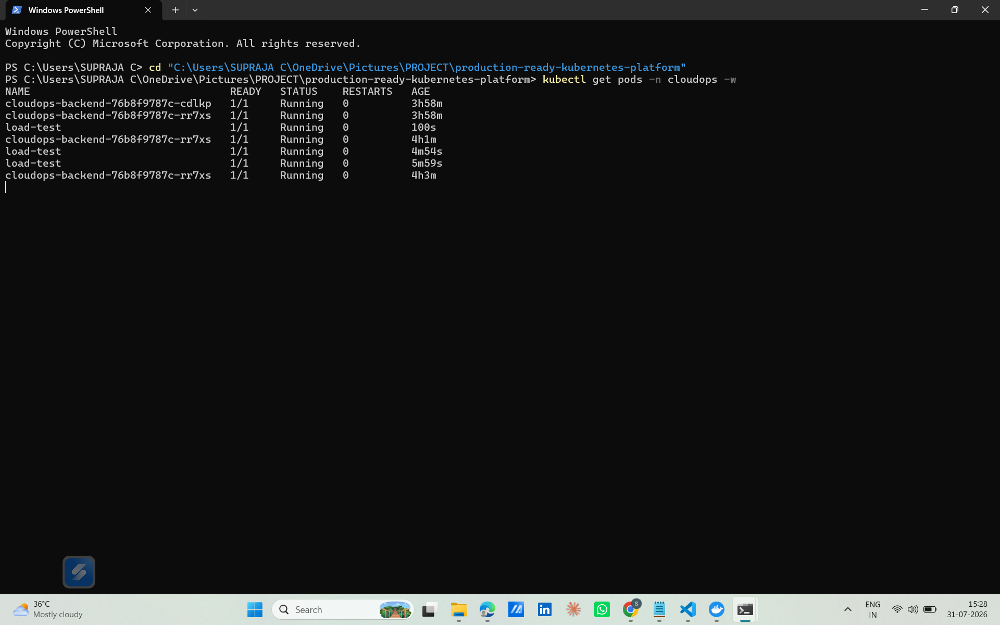

---

## Kubernetes Cluster Status & Autoscaling

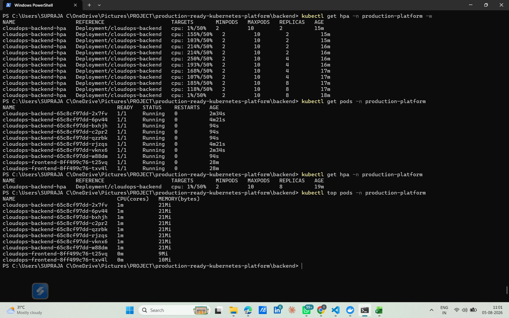

---

# 4️⃣ Ingress

## Ingress Configuration

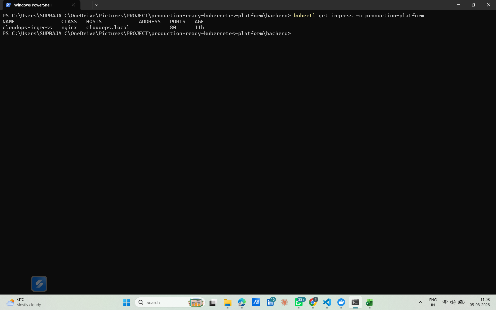

---

## Services

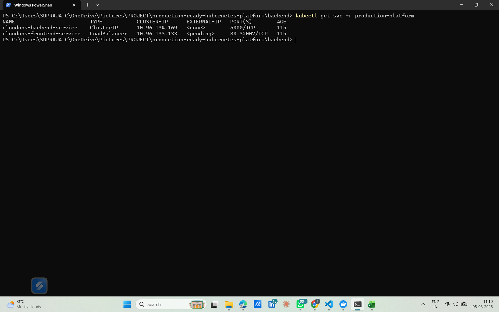

---

## Rolling Update History

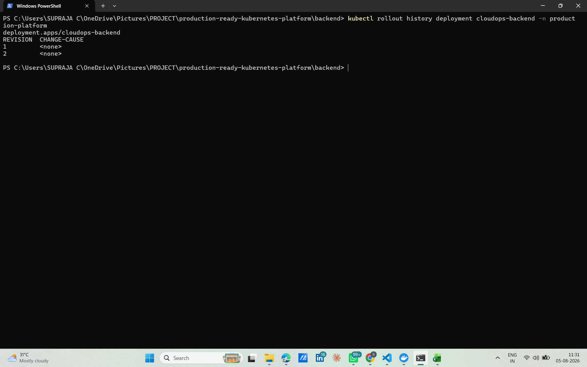

---

# 5️⃣ Monitoring

## Grafana Dashboard

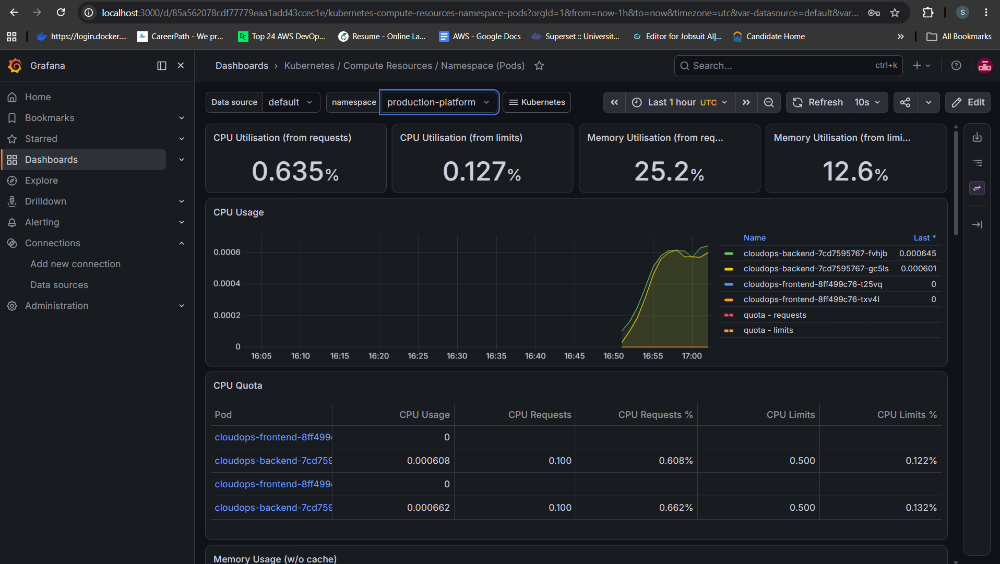

---

# 6️⃣ CloudOps Dashboard

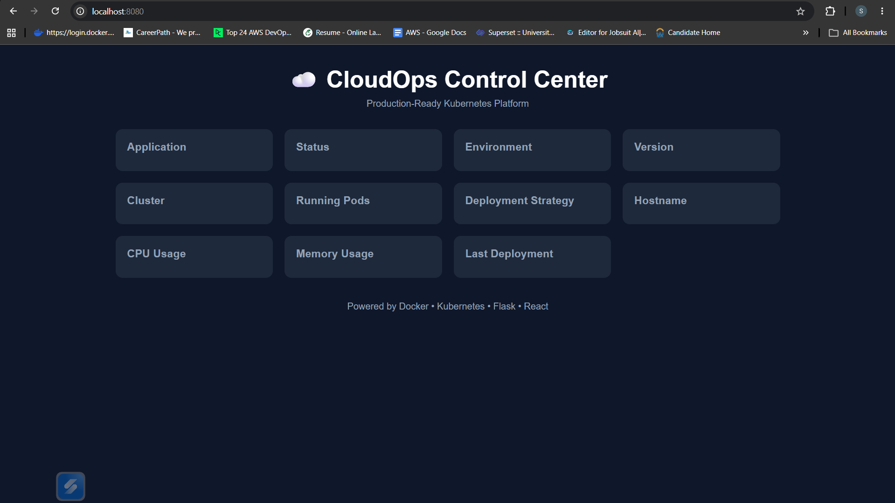

---

# 7️⃣ Persistent Storage

## Persistent Volume Claim

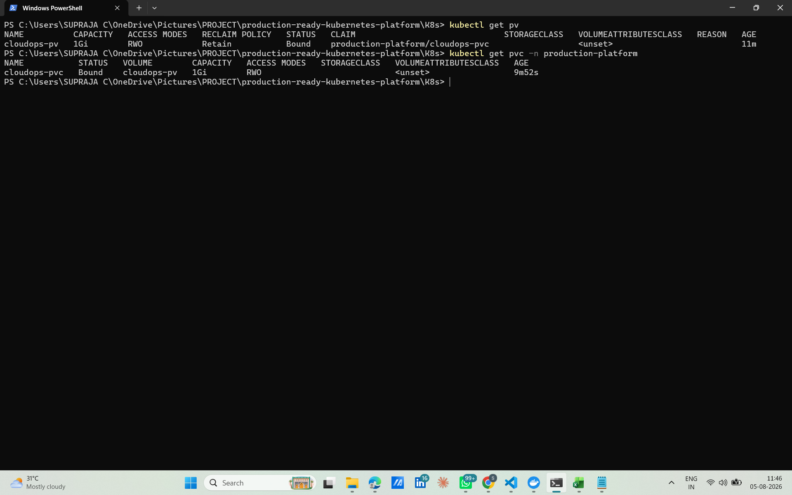

---

# 8️⃣ Network Policy

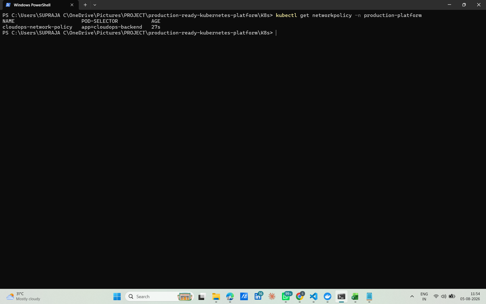

---

# 9️⃣ Helm

## Helm List

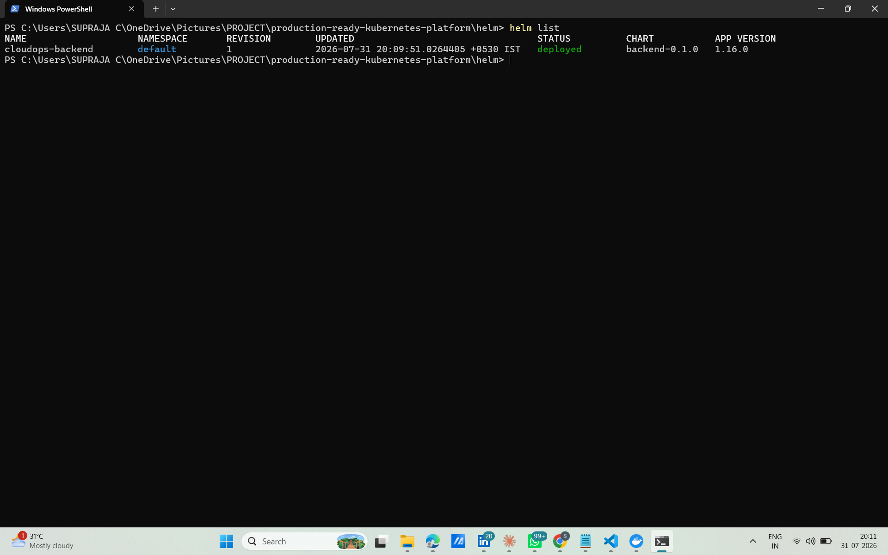

---

## Helm Releases

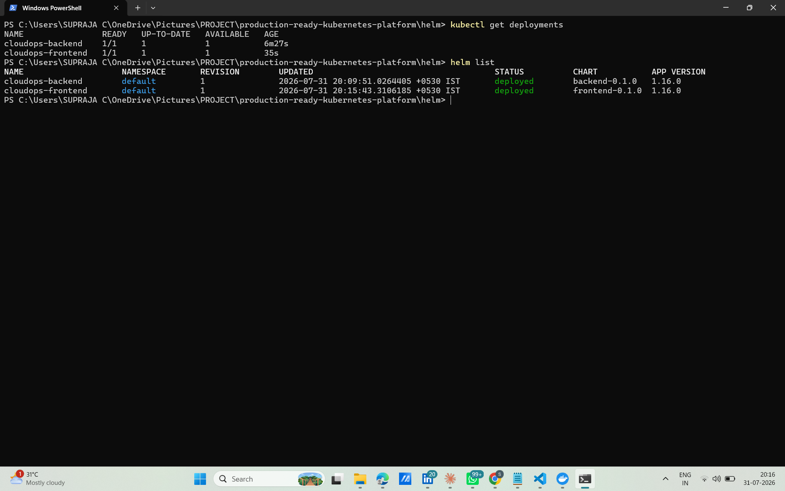

---

## Helm History

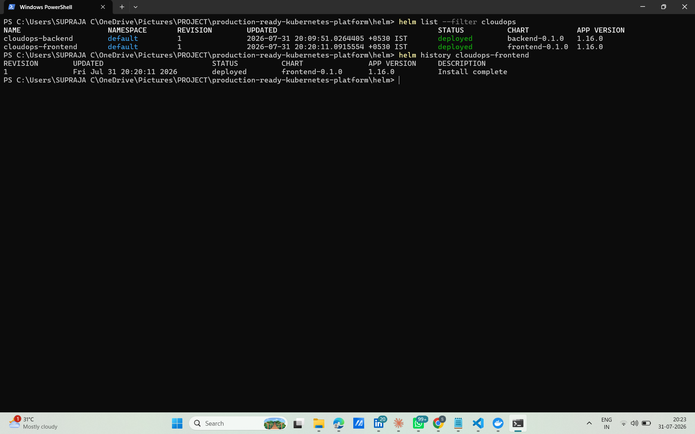

---

## Kubernetes Resources After Helm

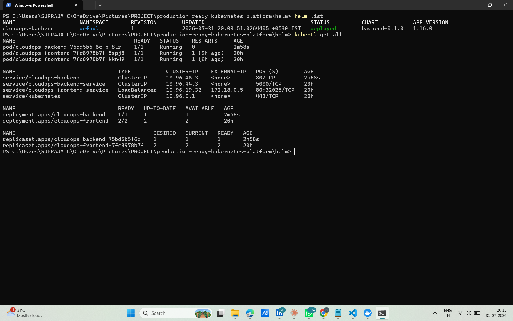

---

## Kubernetes After Helm

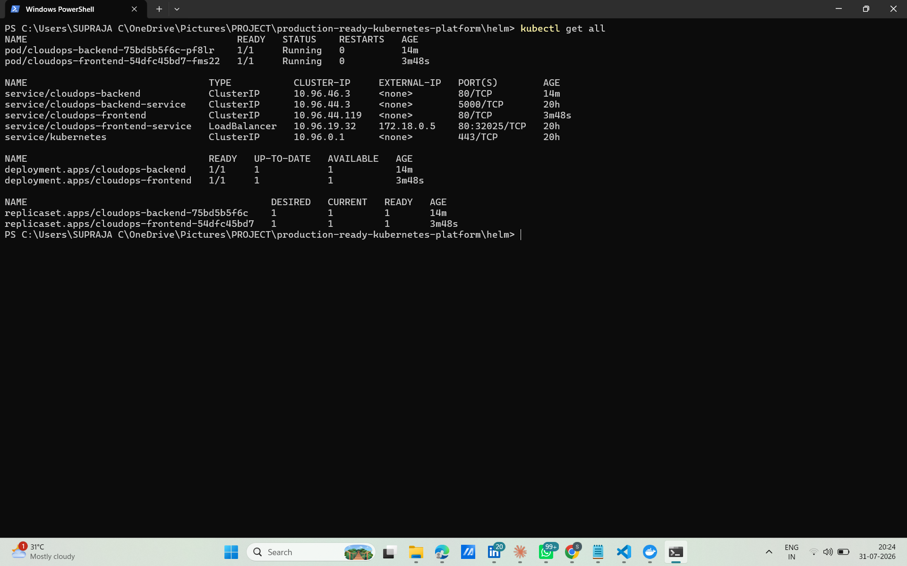

---

# 📊 Monitoring

- Prometheus
- Grafana
- Kubernetes Metrics Server

---

# 🔐 Security

- ConfigMaps
- Secrets
- Network Policies

---

# 📦 Storage

- Persistent Volume
- Persistent Volume Claim

---

# ⚡ Autoscaling

- Horizontal Pod Autoscaler
- CPU Based Scaling

---

# 🚀 Deployment

```bash
kubectl apply -f K8s/
```

---

# 📈 Monitoring

```bash
kubectl top pods
kubectl top nodes
```

---

# 👩‍💻 Author

**Supraja**

GitHub:
https://github.com/suprajasree

LinkedIn: https://www.linkedin.com/in/supraja-c


